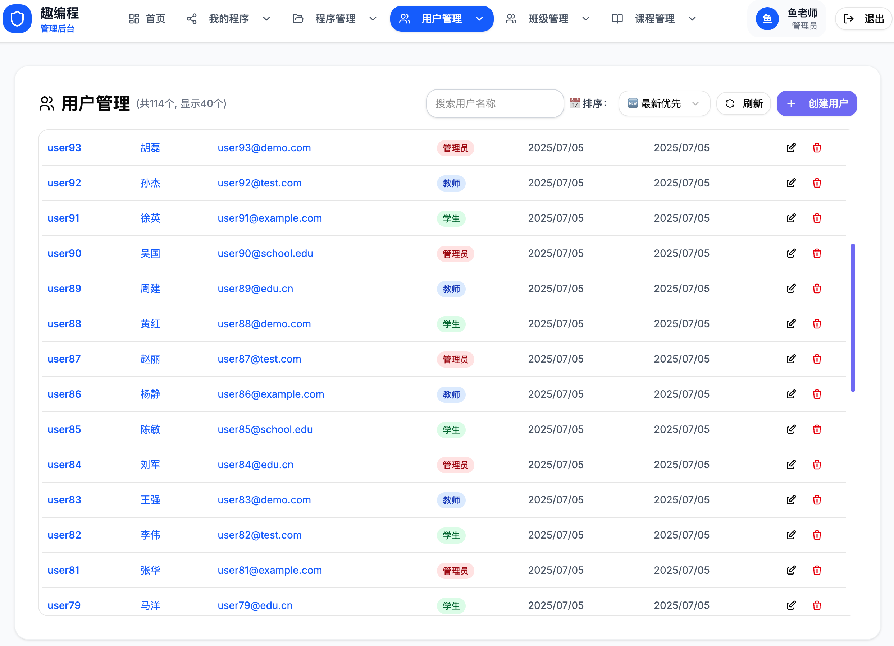

# FunCode

[中文](/Readme.zh.md) | [English](/Readme.md)

## Introduction

FunCode Scratch Editor is an ultra-lightweight open-source graphical programming system for children, designed as a replacement for the desktop Scratch editor. Compared to other open-source Scratch systems, its main feature is extremely simple deployment: it uses an SQlite file database, requires no configuration, and users only need to download and run the program to provide a complete service including user management and Scratch graphical programming on their local computer. The system is compatible with Windows, Linux, and Mac, and is especially suitable for individuals or small children's programming training institutions.

This project is still under development. If you are interested, you are welcome to join and improve it together.

Currently, there is a QQ group: 749870231. Welcome to join and discuss.

## Installation and Usage Guide

### Download

Download address: https://github.com/mail2fish/fun_code/releases

### Run

After running the program, a `funcode_server` directory will be automatically created to store service configuration information and students' program files.

It is recommended to place the funcode program in a separate directory for unified management of related files.

#### Running on Windows

#### Running on Mac or Linux

Open the terminal, go to the directory where the funcode program is located, and execute the following commands:

<span style="color:red">Note: Please replace ./funcode_darwin_arm64 in the command with the actual downloaded program name.</span>

```
chmod +x ./funcode_darwin_arm64
./funcode_darwin_arm64
```

After the program runs normally, the interface is as shown below:


On the first run, an administrator account will be automatically created. The username is `admin`, and the password will be prompted once in the terminal. You can later check the default password in the `funcode_server/config/config.yaml` file. If you change the password in the admin panel later, the default password will become invalid.

In addition, on the first run, the default listening port is 8080. If port 8080 is already occupied, the program will automatically increment the port number and try other available ports (such as 8081).

### Access the Service

Open your browser and visit the address shown in the terminal to access the service.

1. Login


### Student Interface

1. Student Dashboard


2. My Projects


3. My Classes


4. My Shares


5. All Shares


6. Resource Files


### Admin Interface

After logging in, you will enter the admin panel, where you can manage students, projects, classes, and other information.

1. User List



2. Create User

In the admin panel, click the "Create User" button to open the new user interface.


3. Access the Scratch Graphical Programming System

Click the "New Scratch Project" button in the interface to enter the Scratch graphical programming system.


4. Resource File Management

In the admin panel, click the "Resource Files" button to open the resource file management interface.


5. Resource File List


6. Class List


7. Create Class


8. Course List


9. Create Course


10. Lesson List


11. Create Lesson


## Build Guide

### Prerequisites

- Go 1.24+
- NodeJs 23.9.0+

### Build Commands

Get help information

```
make help
```

Available make commands:
```
  all              - Build the project for all platforms
  clean            - Clean build files
  deps             - Install Go dependencies
  frontend-deps    - Install frontend dependencies
  build-go-all     - Build Go project for all platforms
  build-go-{os}-{arch} - Build Go project for the specified platform
  build-frontend   - Build React frontend
  build-scratch    - Build Scratch project
  dev              - Run Go development server
  dev-frontend     - Run frontend development server
  dev-scratch      - Run Scratch development server
  test             - Run Go tests
  test-frontend    - Run frontend tests
  test-scratch     - Run Scratch tests
  fmt              - Format code
  lint             - Lint code
  help             - Show help information

Supported platform and architecture combinations:
  windows-amd64    - Windows 64-bit
  linux-amd64      - Linux 64-bit
  darwin-amd64     - macOS Intel
  darwin-arm64     - macOS ARM
```
The generated executable files are in the build directory.

## Development Guide

The project is divided into two parts: the server and the web client.

You must build the client before building the server; otherwise, even if the server is built successfully, it will not work due to the lack of the frontend.

### Client

The client code is mainly in the `web` directory, including two parts: `scratch` and `react-router-www`.

`scratch` is the client code for the Scratch graphical programming system, and `react-router-www` is the client code for the student management system.

#### 2.1.1 Prerequisites

Install NodeJs

#### 2.1.2 Scratch Client

The code is in the `web/scratch` directory. This part simply wraps the Scratch GUI API to build an interface.

##### 2.1.2.1 Build Scratch GUI

Before building `web/scratch`, you need to build Scratch GUI first.

Note: Do not use npm to install scratch-gui, because some code has been modified, so you need to build from source.

```
git clone https://github.com/mail2fish/scratch-gui/
git checkout -b main_fun_code origin/main_fun_code
cd scratch-gui
npm install
BUILD_MODE=dist npm run build
npm link    
```

`mail2fish/scratch-gui/` is a forked and customized version from https://github.com/scratchfoundation/scratch-gui. Its develop branch will be synchronized with the original repository.

Note: Use the project's `main_fun_code` branch.

##### 2.1.2.2 Build web/Scratch

Build static files

```
cd web/scratch
npm link scratch-gui
npm install
npm run build
```

Start dev environment

```
cd web/scratch
npm link scratch-gui
npm start
```

#### 2.1.3 Student Management System

The code is in the `web/react-router-www` directory. This is a student management system developed based on ReactRouter and [shadcn](https://ui.shadcn.com/).

The project uses React-Router, so you need to install [React-Router](https://reactrouter.com/)

Build static files

```
cd web/react-router-www
npm install
npm run build
```

Start dev environment

```
cd web/react-router-www
npm install
npm run dev
```

### 2.2 Server

The server is developed in Go, based on Gin and GORM frameworks, and uses SQLite database.

The code is mainly in the `internal` directory.

```
go mod tidy
go build -o ./fun_code ./cmd/fun_code/main.go
```
You only need to run `go build` to build the program.

After the build is complete, an executable file will be generated. Run this file to start the server.

⚠️**Note: Before building the server, you must first build the client static files, because the server needs to use the static files built by the client.** 

### 2.3 Deployment on Linux

#### 2.3.1 supervisord

Used to manage the service as a daemon process.

https://github.com/ochinchina/supervisord

Do not run as root. Refer to `deploy/supervisord.conf` for configuration.

#### 2.3.2 Map port 80

```
sudo sysctl net.ipv4.ip_forward=1

# To make it permanent, edit /etc/sysctl.conf or create a new file under /etc/sysctl.d/, add:
# net.ipv4.ip_forward = 1
# Then run sudo sysctl -p
```

```
sudo iptables -t nat -A PREROUTING -p tcp --dport 80 -j REDIRECT --to-port 8080
```

If you want to forward port 80 from localhost to 8080, you also need to add an OUTPUT chain rule:

```
sudo iptables -t nat -A OUTPUT -p tcp -d 127.0.0.1 --dport 80 -j REDIRECT --to-port 8080
# For IPv6 (if needed):
# sudo ip6tables -t nat -A PREROUTING -p tcp --dport 80 -j REDIRECT --to-port 8080
# sudo ip6tables -t nat -A OUTPUT -p tcp -d ::1 --dport 80 -j REDIRECT --to-port 8080
```

```
sudo apt update
sudo apt install iptables-persistent
# During installation, you will be prompted whether to save the current IPv4 and IPv6 rules, select "Yes".
# If you modify the rules later, you need to save them manually:
sudo netfilter-persistent save
```

## Cross-platform Compilation

Using sqlite requires installing cgo.

