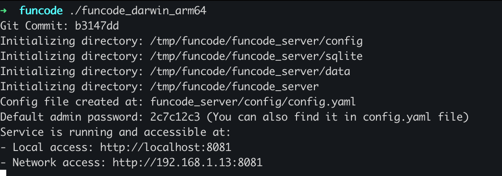
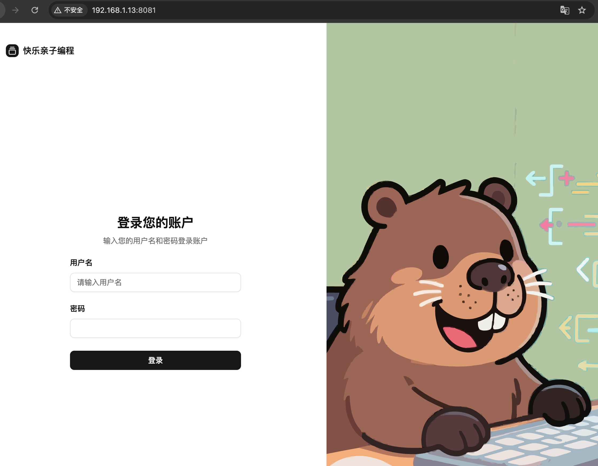
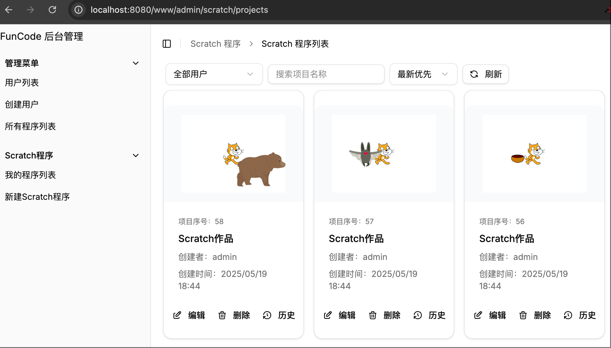
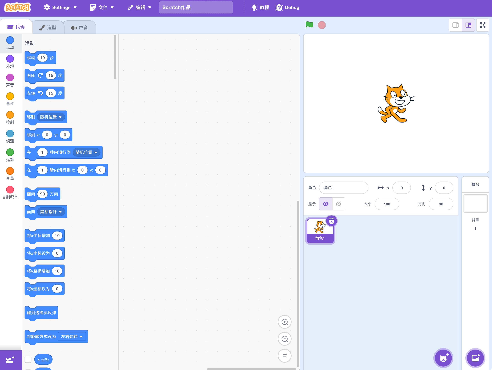
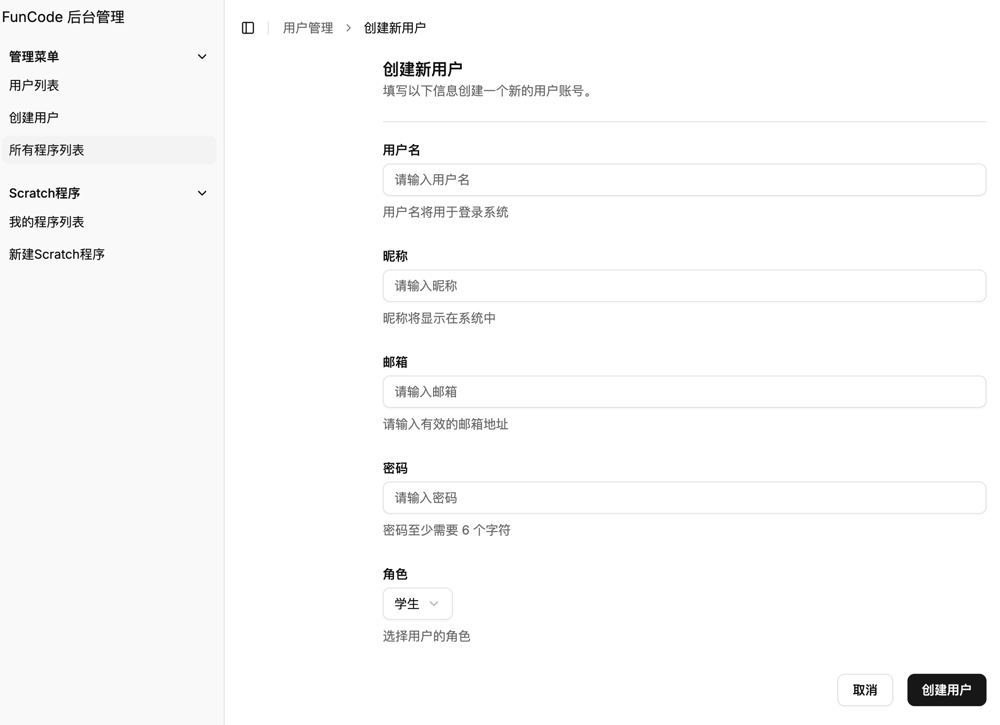

# FunCode

[中文](/Readme.zh.md) | [English](/Readme.md)

## 简介

趣编程Scratch编辑器是一个可以替代桌面版 Scratch编辑器的，超轻的开源少儿图形化编程系统，和其他的Scratch开源的系统相比，它的特点在于部署超级简单，使用SQlite 文件数据库，用户无需任何配置，只需下载并运行程序，即可在本地计算机上提供包含用户管理和 Scratch 图形编程的完整服务。该系统兼容 Windows、Linux、Mac 等主流操作系统平台，尤其适合个人，或者小型少儿编程培训机构使用。
 
这个项目目前还在开发中，有兴趣的朋友可以加入一起完善。

目前有QQ群：749870231，欢迎加入一起讨论。

## 安装运行指南

### 下载

下载地址：https://github.com/mail2fish/fun_code/releases

### 运行

程序运行后会自动创建一个 funcode_server 目录，用于存储服务配置信息和学员的程序文件。

建议将 funcode 程序放置在一个独立的目录下，便于统一管理相关文件。

#### 在 Windows 下运行

#### 在 Mac 或 Linux 下运行

打开终端，进入 funcode 程序所在目录后，执行以下命令：

<span style="color:red">注意：请根据实际下载的程序名称，将命令中的 ./funcode_darwin_arm64 替换为对应的文件名。</span>


```
chmod +x ./funcode_darwin_arm64
./funcode_darwin_arm64
```

程序正常运行后，界面如下图所示：



首次运行时会自动创建一个管理员账号，用户名为 admin，密码会在终端中提示一次。之后可在 funcode_server/config/config.yaml 文件中查看默认密码。若在管理后台修改过密码，则该默认密码将失效。

此外，首次运行时，默认监听端口为 8080。如果 8080 端口已被占用，程序会自动递增端口号，尝试其他可用端口（如 8081）。


### 访问服务

打开浏览器，访问终端中提示的地址，即可访问服务。



### 系统界面

登录后，会进入管理后台，在管理后台中可以管理学员、项目、班级等信息。



### 访问 Scratch 图形化编程系统

点击界面中的新建Scratch程序按钮，即可进入 Scratch 图形化编程系统。



### 创建用户界面

在管理后台中，点击创建用户按钮，即可打开新建用户界面。



## 构建指南

### 前置依赖
- Go 1.24+
- NodeJs 23.9.0+

### 构建指令

获取帮助信息

```
make help
```

make 可用命令:
```
  all              - 构建所有平台的项目
  clean            - 清理构建文件
  deps             - 安装 Go 依赖
  frontend-deps    - 安装前端依赖
  build-go-all     - 构建所有平台的 Go 项目
  build-go-{os}-{arch} - 构建指定平台的 Go 项目
  build-frontend   - 构建 React 前端
  build-scratch    - 构建 Scratch 项目
  dev              - 运行 Go 开发服务器
  dev-frontend     - 运行前端开发服务器
  dev-scratch      - 运行 Scratch 开发服务器
  test             - 运行 Go 测试
  test-frontend    - 运行前端测试
  test-scratch     - 运行 Scratch 测试
  fmt              - 格式化代码
  lint             - 检查代码质量
  help             - 显示帮助信息

支持的平台和架构组合:
  windows-amd64    - Windows 64位
  linux-amd64      - Linux 64位
  darwin-amd64     - macOS Intel
  darwin-arm64     - macOS ARM
```
生成的可执行文件在 build 目录下

## 开发指南

项目分为两个部分，一个是服务端，另一个是网页的客户端。

构建服务端之前必须先构建客户端，否则即使服务端构建成功，也会因为缺少前端界面，而无法使用。

### 客户端

客户端代码主要在 web 目录下, 包含两个部分 scratch 和 react-router-www。

scratch 是 Scratch 图形化编程系统的客户端代码，react-router-www 是学员管理系统的客户端代码。

#### 2.1.1 前置依赖

安装 NodeJs

#### 2.1.2 Scratch 客户端

代码在 web/scratch 目录下，这部份代码，只是简单的封装了 Scratch GUI 的 API 构建一个界面。


##### 2.1.2.1 构建 Scratch GUI

在构建 web/scratch 之前，需要先构建 Scratch GUI。

注意不能使用 npm 安装 scratch-gui，因为修改了一些代码，所以需要从源码构建。

```
git clone https://github.com/mail2fish/scratch-gui/
git checkout -b main_fun_code origin/main_fun_code
cd scratch-gui
npm install
BUILD_MODE=dist npm run build
npm link    
```

mail2fish/scratch-gui/ 是从 https://github.com/scratchfoundation/scratch-gui  Fork 出来的一个魔改版本，它的 develop 分支会和原库同步。

注意：使用项目的 main_fun_code 分支。


##### 2.1.2.2 构建 web/Scratch 

构建静态文件

```
cd web/scratch
npm link scratch-gui
npm install
npm run build
```

启动 dev 环境

```
cd web/scratch
npm link scratch-gui
npm start
```


#### 2.1.3 学员管理系统

代码在 web/react-router-www 目录下, 这是一个基于 ReactRouter 和 [shadcn](https://ui.shadcn.com/) 开发的学员管理系统。

项目使用 React-Router 构建，所以需要安装 [React-Router](https://reactrouter.com/)


构建静态文件

```
cd web/react-router-www
npm install
npm run build

```

启动 dev 环境
```
cd web/react-router-www
npm install
npm run dev
```

### 2.2 服务端

服务端使用Go语言开发，基于Gin，GORM 框架，使用 Sqllite 数据库。

代码主要在 internal 目录下。

```
go mod tidy
go build -o ./fun_code ./cmd/fun_code/main.go
```
构建程序只需要 go build 即可。

构建完成后，会生成一个可执行文件，运行该文件即可启动服务端。

⚠️**注意：构建服务端之前，必须要先构建客户端的静态文件，因为服务端需要使用客户端构建后的静态文件。** 


### 2.3 Linux 下部署

#### 2.3.1 supervisord

用于管理服务的守护进程。

https://github.com/ochinchina/supervisord

注意不要用 root 账号运行，配置参考 deploy/supervisord.conf

#### 2.3.2 映射 80 端口

```
sudo sysctl net.ipv4.ip_forward=1

# 使其永久生效，编辑 /etc/sysctl.conf 或在 /etc/sysctl.d/ 下创建新文件，添加:
# net.ipv4.ip_forward = 1
# 然后运行 sudo sysctl -p
```


```
sudo iptables -t nat -A PREROUTING -p tcp --dport 80 -j REDIRECT --to-port 8080
```

如果你希望从本机（localhost）访问 80 端口也能转发到 8080，还需要添加 OUTPUT 链规则：

```
sudo iptables -t nat -A OUTPUT -p tcp -d 127.0.0.1 --dport 80 -j REDIRECT --to-port 8080
# 对于 IPv6 (如果需要):
# sudo ip6tables -t nat -A PREROUTING -p tcp --dport 80 -j REDIRECT --to-port 8080
# sudo ip6tables -t nat -A OUTPUT -p tcp -d ::1 --dport 80 -j REDIRECT --to-port 8080
```


```
sudo apt update
sudo apt install iptables-persistent
# 安装过程中会提示是否保存当前 IPv4 和 IPv6 规则，选择 "是"。
# 如果之后修改了规则，需要手动保存：
sudo netfilter-persistent save
```

## 跨平台编译

使用 sqlite 需要安装 cgo。